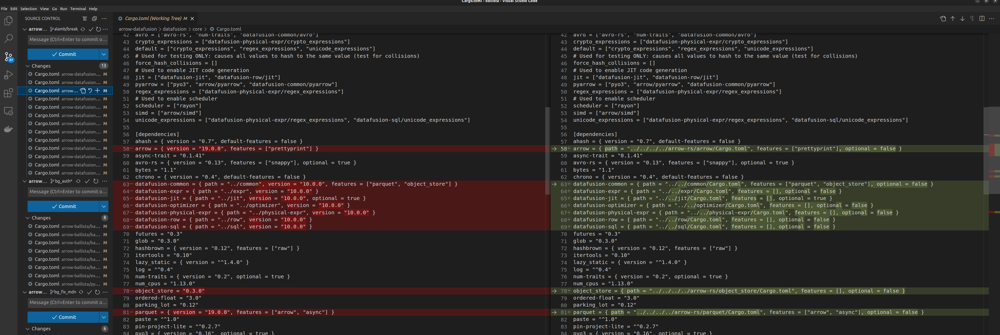

# workspace-gen

Given several subdirectories containing cargo projects, creates a parent workspace manifest file.

Find it on [crates.io](https://crates.io/crates/workspace-gen).

## Usage

```sh
git clone x                   # clone a project into a subfolder
git clone y                   # clone a 2nd project 
cargo install workspace-gen   # add this executable to the path
workspace-gen local-path      # switch paths to local for hacking
cargo build                   # A Cargo.toml now exists, and should wrap both subprojects in a workspace!
workspace-gen git-ref         # switch paths to git refs to share work with others
workspace-gen --help          # display message below
```

```
workspace-gen 0.3.0
Given several subdirectories containing cargo projects, creates a parent workspace manifest file

USAGE:
    workspace-gen <MODE>

ARGS:
    <MODE>    What mode to run the program in [possible values: local-path, git-ref, version]

OPTIONS:
    -h, --help       Print help information
    -V, --version    Print version information
```

## Convention over configuration

Tips:

- To use `git-ref` mode, name the upstream remote `upstream`
- Use an HTTP URL for fetching by setting [two separate URLS](https://stackoverflow.com/questions/2916845/different-default-remote-tracking-branch-for-git-pull-and-git-push) 
                                                         
## Example Output



```toml
[workspace]
members = [
    "arrow-datafusion/datafusion-examples",
    "arrow-datafusion/benchmarks",
    "arrow-datafusion/datafusion/physical-expr",
    "arrow-datafusion/datafusion/jit",
    "arrow-datafusion/datafusion/proto",
    "arrow-datafusion/datafusion/row",
    "arrow-datafusion/datafusion/core/fuzz-utils",
    "arrow-datafusion/datafusion/core",
    "arrow-datafusion/datafusion/sql",
    "arrow-datafusion/datafusion/expr",
    "arrow-datafusion/datafusion/optimizer",
    "arrow-datafusion/datafusion/common",
    "arrow-datafusion/datafusion-cli",
    "arrow-ballista/benchmarks",
    "arrow-ballista/ballista/rust/client",
    "arrow-ballista/ballista/rust/core",
    "arrow-ballista/ballista/rust/executor",
    "arrow-ballista/ballista/rust/scheduler",
    "arrow-ballista/ballista-cli",
    "arrow-ballista/python",
    "arrow-ballista/examples",
    "arrow-rs/integration-testing",
    "arrow-rs/parquet",
    "arrow-rs/arrow",
    "arrow-rs/object_store",
    "arrow-rs/arrow-flight",
    "arrow-rs/parquet_derive_test",
    "arrow-rs/parquet_derive",
    "arrow-rs/arrow-pyarrow-integration-testing"
]
exclude = [
    "arrow-datafusion",
    "arrow-ballista",
    "arrow-rs"
]
```